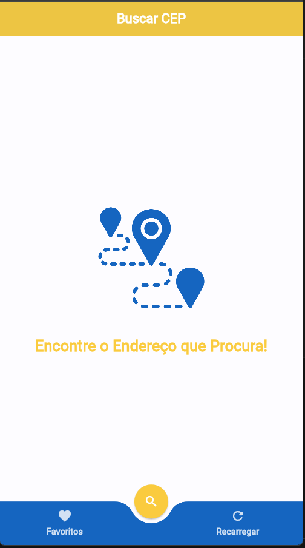
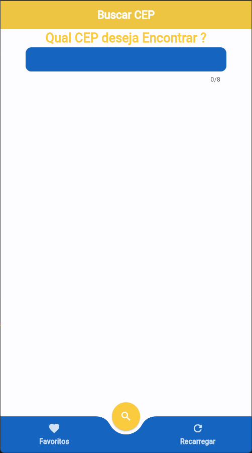
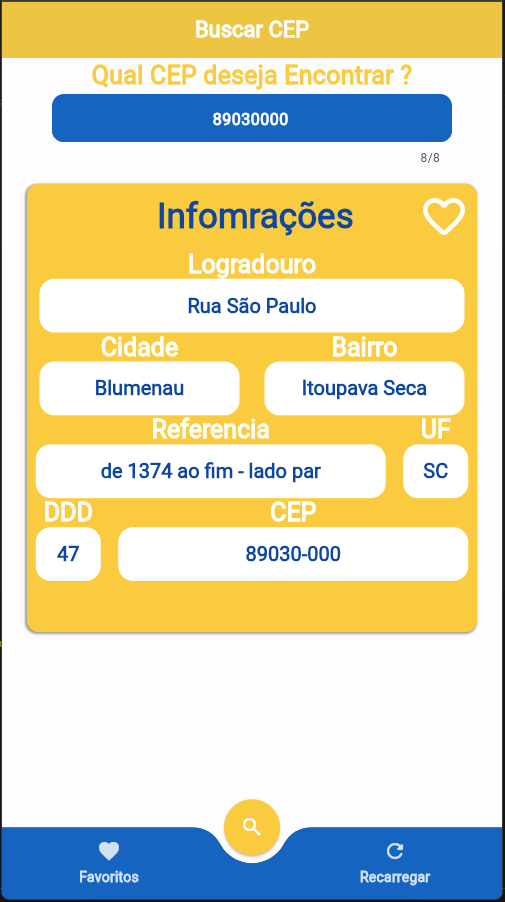
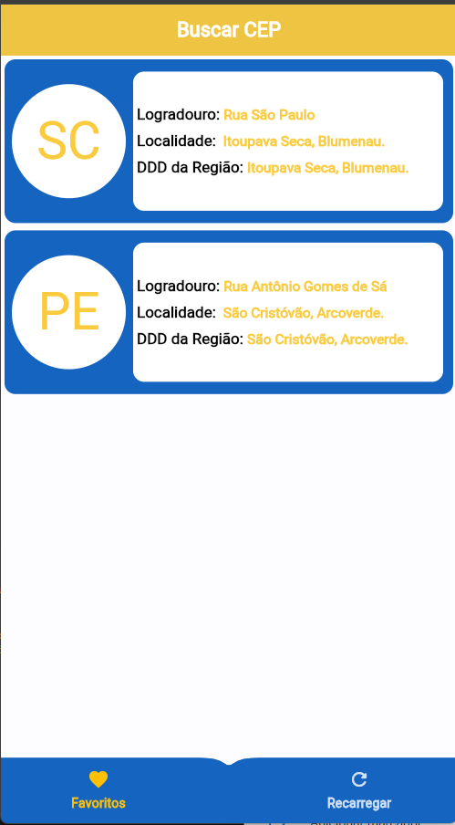
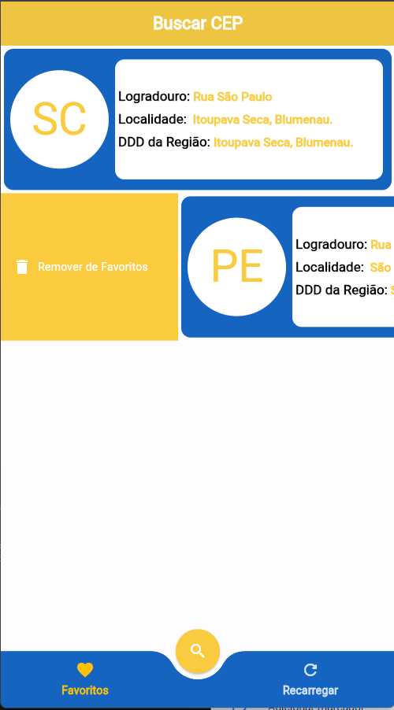
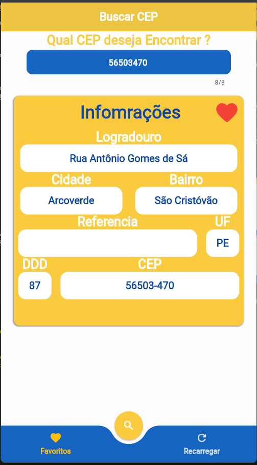

# Cep_App

Consulte qualquer cep de maneira simples qualquer Cep. Quem nunca precisou de um uma informação rápida sobre um determinado lugar aqui está a ferramenta.

## Objetivo do App:
Consulta e persistir dados em um serviço externo baseado nas consultas do usuário,  modelo de arquitetura utilizado MVVM, com uso do provider para gerencia de estado, sendo  implementações limitadas apenas aos [packages](https://pub.dev/) necessários a suas atuações.

Aplicativo completo a o que se remete a fazer com a possibilidade de persistir os dados para consulta posterior por meio de uma implementação simples de [CRUD](https://coodesh.com/blog/dicionario/o-que-e-crud/) em um serviço externo.

## Preview

## Stack utilizada

**Front-end e Back-end:**  

##   **Descrição das Tarefas**

- ### Consulta de CEP:
    > Atravez do fornecimento de determinado cep pode se consultar as informações complemnetares do mesmo.
    
- ### Salvar resultados.
    > Poder salvar dados para consultar futuramente em um serviço externo.

- ### Deletar Consultas.
    > Exclui dados salvos.

### **Packages Utilizados:**
[dio: ^4.0.6](https://pub.dev/packages/provider)
- Possibilita o a implementação das atividade de http, de modo qeu possibilita a ultilização e interação de serviços externos.

[shared_preferences 2.2.3](https://pub.dev/packages/shared_preferences)
 - Possibilidade de salvare carregar dados localmente atravez de **chave e valor**.

[provider 6.1.2](https://pub.dev/packages/provider)
- Possibilita o gerenciamento de estado baseado na ação d o usuario.

[animated_bottom_navigation_bar: ^1.3.3](https://pub.dev/packages/animated_bottom_navigation_bar)
- Possibilita a implementação d eum bootom bar Customizada e animada a qual trasnforma  o aplicativo em algo mais intuitivo e interessante.

## Serviços ultilizados:
[back4app](https://www.back4app.com/)
- Serviço de banco de dados Nosql, simples e completo para aplicações, com integrações diverssas.
- Serviso ultlizado: Persistencia com integração API-Rest.

## Documentação útil::

Alguns recursos para você enteder mais sobre um projeto Flutter:

- [Laboratório: Escreva seu primeiro aplicativo Flutter](https://docs.flutter.dev/get-started/codelab)
- [Livro de receitas: exemplos úteis do Flutter](https://docs.flutter.dev/cookbook)

Para obter ajuda para começar a desenvolver o Flutter, consulte o
[documentação online](https://docs.flutter.dev/), que oferece tutoriais,
exemplos, orientações sobre desenvolvimento móvel e uma referência completa da API.

## Etiquetas

 